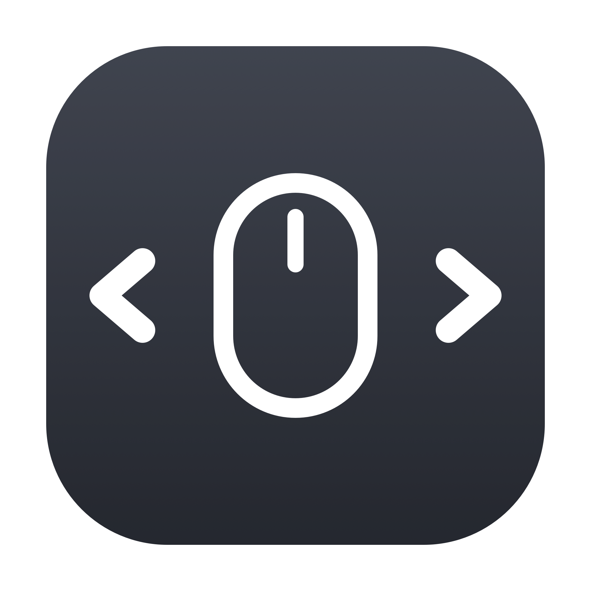

<div align="center">
  
  <h1>PC Mouse for Mac</h1>
  <p>Make a regular PC mouse feel at home on a Mac — desktop switching, sane scroll direction, trackpad-like smooth scrolling, and side-button remapping. One lightweight menu bar app, <b>one</b> permission.</p>
</div>

---

## Features

| Feature | What it does |
|---|---|
| **Desktop Switcher** | Switch between desktops with **Ctrl + Scroll Wheel** — perfect for a traditional PC mouse. |
| **ScrollFix** | Independent scroll directions: the mouse scrolls traditionally while the trackpad stays natural — **works no matter how your system Natural Scrolling is set**. |
| **Smooth Scrolling** | Turns the mouse wheel's chunky, line-by-line jumps into an animated pixel glide — much closer to a trackpad. |
| **Mouse Buttons** | Remap the side (thumb) buttons to Desktop Left/Right, Mission Control, or App Windows — remapping macOS doesn't offer natively. |

Toggle each feature on/off from the **menu bar** icon. Everything runs inside **one** background app (`PCMouseForMac.app`); adding a new feature later needs **no new permission** — it's all one process.

## Why one app?

The old version shipped two separate binaries, each needing its own Accessibility grant, and the services could get stuck in a permission-prompt loop. The current design fixes both:

- ✅ **One permission** — a single **Accessibility** grant (no Input Monitoring needed).
- ✅ **No prompt loop** — the app asks once, then waits quietly and activates the moment you grant access. No restart, no "stop the service first" dance.
- ✅ **No sudo** — installs to `~/Applications`, not `/usr/local/bin`.
- ✅ **Code-signed bundle** with a stable identifier, so the permission survives rebuilds.

## Requirements

- macOS 11 (Big Sur) or later
- Swift toolchain — `xcode-select --install` (no full Xcode required)

## Install

```bash
git clone https://github.com/halitince7/pc-mouse-for-mac.git
cd pc-mouse-for-mac
bash scripts/build-app.sh
```

This compiles, signs, installs `PCMouseForMac.app` to `~/Applications`, and starts it as a login agent. On the first run it also creates a **stable, per-machine self-signed signing identity** (via `scripts/setup-signing.sh`) so the Accessibility permission you grant survives every future rebuild — no re-granting.

**Final step — grant one permission:**

> **System Settings → Privacy & Security → Accessibility → enable `PC Mouse for Mac`**

It starts working immediately after you flip the switch. It also launches automatically on every login.

## Control panel

PC Mouse for Mac lives in the **menu bar** (no Dock icon, no window clutter). Click
the mouse icon to open a small, modern SwiftUI panel:

- **Header** — app icon, name, and version.
- **Permission banner** — appears only when Accessibility isn't granted yet,
  with a one-click **Open** button that jumps straight to the right Settings pane.
- **Feature rows** — one per feature (Desktop Switcher, ScrollFix), each with an
  icon, a short description, and a **toggle switch**. Flipping a switch takes
  effect instantly; your choices persist across restarts.
- **Footer** — a shortcut to the Accessibility settings and a **Quit** button.

> 💡 The panel is only for control. The features keep working in the background
> whether or not the panel is open.

## Usage

Click the **mouse icon in the menu bar** to open the control panel — toggle each
feature, see the permission status, and quit from there.

- **Switch desktops:** hold **Ctrl** and scroll the mouse wheel up / down.
- **Scroll direction:** your mouse scrolls the traditional way while the trackpad
  stays natural. This holds whether macOS *Natural Scrolling* is ON or OFF — the
  app reads the system setting and adjusts automatically.
- **Smooth scrolling:** each wheel notch glides instead of jumping. Note this is
  animated smoothing, not trackpad momentum — a wheel has no "release" gesture,
  so there's no inertial flick; rapid notches just accumulate into a longer glide.
- **Horizontal scroll:** hold **Shift** and use the wheel to scroll sideways —
  this keeps working (and stays smooth) with Smooth Scrolling enabled.
- **Mouse buttons:** enable *Mouse Buttons*, then pick an action for the back and
  forward (thumb) buttons. Set a button to **None** to leave it untouched — the
  system default (e.g. browser back/forward) keeps working.
- Clicking `PCMouseForMac.app` again (from Finder / Launchpad) just re-opens the
  menu-bar panel; it never launches a second copy.

## Uninstall

```bash
bash scripts/build-app.sh uninstall
```

Then remove `PC Mouse for Mac` from **System Settings → Privacy & Security → Accessibility**.

## Project layout

```
src/
  main.swift                        # NSApplication bootstrap
  Core/Constants.swift              # bundle id, notification names, version
  Core/AppSettings.swift            # persisted feature toggles
  Core/PermissionMonitor.swift      # Accessibility trust state (drives UI)
  Core/ScrollDirectionMonitor.swift # reads the system Natural Scrolling setting
  Core/SmoothScroller.swift         # animated pixel-glide for the mouse wheel
  Core/ButtonAction.swift           # actions a remapped mouse button can trigger
  Core/EventTapEngine.swift         # the CGEvent tap + feature logic
  App/AppDelegate.swift             # menu bar item, popover, single instance
  UI/MenuView.swift                 # SwiftUI control panel
scripts/
  build-app.sh                      # build + sign + install   (also: uninstall)
  setup-signing.sh                  # stable self-signed identity (auto-run)
  release.sh                        # Developer ID → DMG → notarize (skeleton)
assets/                             # icon source (make-icon.swift) + AppIcon.icns
```

All Swift files compile together via `swiftc` (no Xcode project needed) — the
build script globs `src/**/*.swift`. Add a new feature as a small type under
`src/Core/` and dispatch to it from `EventTapEngine`.

## Development

After editing any source file, just rebuild:

```bash
bash scripts/build-app.sh
```

It recompiles, re-signs with the same **stable identity**, reinstalls to
`~/Applications`, and restarts the login agent. Because the signing identity is
unchanged, the Accessibility permission carries over — **no re-granting between
rebuilds**. Toggling a feature at runtime takes effect immediately (no rebuild
needed) via the menu-bar panel.

## Distribution (notarized DMG)

This kind of utility relies on a global event tap + Accessibility, which the
**Mac App Store sandbox does not allow** — so distribution is via a **Developer
ID–signed, notarized** `.app`/DMG (like Rectangle, BetterTouchTool, etc.), not
the App Store.

`scripts/release.sh` is a ready-to-fill skeleton that builds a hardened,
Developer ID–signed app, packages it into a drag-to-install DMG, notarizes it
with Apple, and staples the ticket:

```bash
DEVELOPER_ID="Developer ID Application: Your Name (TEAMID)" \
NOTARY_PROFILE="PCMouseForMac-Notary" \
bash scripts/release.sh
```

It requires a paid Apple Developer account and a one-time
`xcrun notarytool store-credentials` setup (documented at the top of the
script). Local self-signed builds need none of this.

## Roadmap

Planned features and the "one simple toggle" design philosophy live in
[ROADMAP.md](ROADMAP.md). The short version: stay lightweight, on/off by default,
no configuration screens.

## License

[MIT](LICENSE) — free to use, modify, and distribute.
